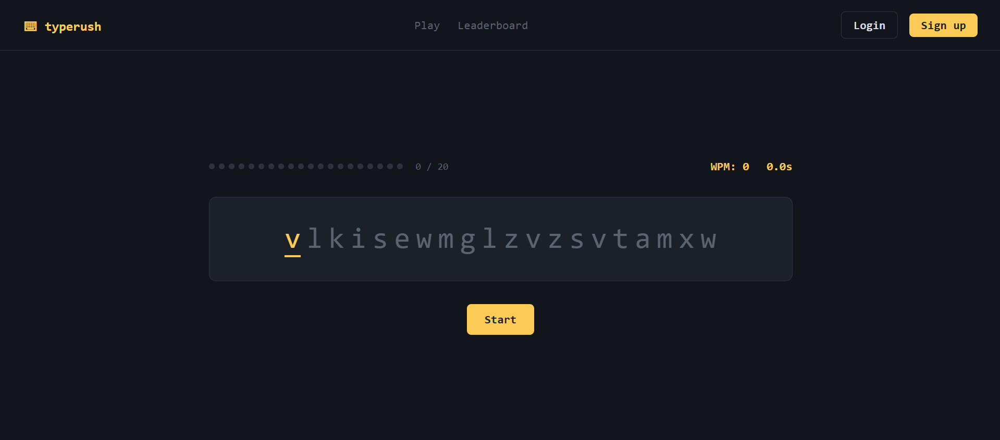
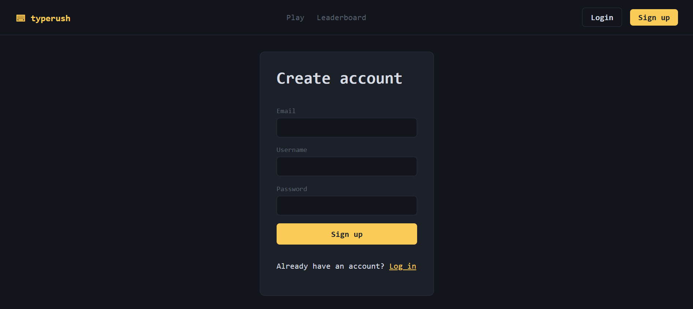
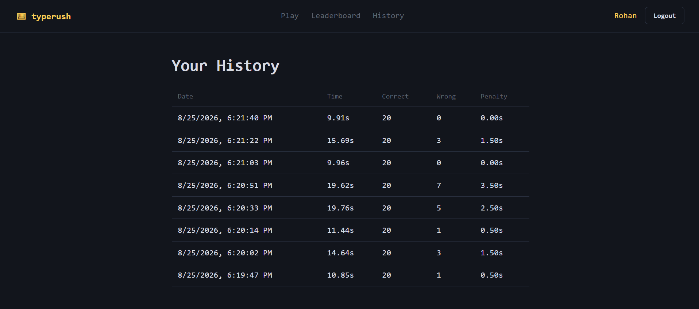
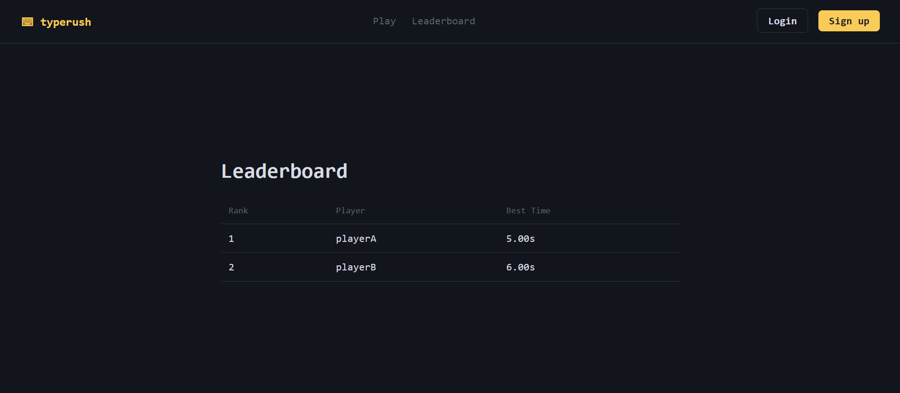

# Typing Speed Game

A full-stack typing speed game. Type 20 randomly generated lowercase letters as fast as
you can — every wrong key adds a 0.5s penalty. Beat your personal best to see
"New Best!"; otherwise you'll see "Try Again."

Built as a submission for the take-home assignment described in the
[full spec](https://docs.google.com/document/d/1c6UMI7ONMrqwPeDIfvTgsRuT1Db3eraPxfmw63s2plI/edit).

---

## Features

- Timer starts at 0s when the game begins
- 20 randomly generated letters, one active at a time
- Correct key press → advance to the next letter
- Wrong key press → 0.5s penalty + shake animation, no advance
- Hidden input keeps focus throughout the game (click-to-refocus fallback)
- Live progress indicator (`x / 20`) and live WPM
- Final score shown at the end; **Success** if it beats the previous best,
  **Try Again** otherwise
- Best score persists locally (`localStorage`) even for guests — no login required
  to play
- Logged-in users additionally get: saved game history, and a public leaderboard
  of best times across all players
- JWT-based registration/login with hashed passwords
- Server-side re-validation of every submitted score (see *Score integrity* below)

## Screenshots

<table>
  <tr>
    <td align="center">
      <b>Home / Typing Game</b><br>
      
    </td>
    <td align="center">
      <b>User Registration</b><br>
      
    </td>
  </tr>
  <tr>
    <td align="center">
      <b>Game History / Your Activity</b><br>
      
    </td>
    <td align="center">
      <b>Leaderboard</b><br>
      
    </td>
  </tr>
</table>

## 🎥 Demo

<video src="https://github.com/user-attachments/assets/ff711f1d-d7c6-41e2-a35d-0d9749ef1462" controls></video>

The demo showcases the complete game flow, including typing, wrong-key penalties,
score calculation, authentication, game history, and the leaderboard.


## Stack

| Layer | Technology |
|---|---|
| Frontend | React + Vite + TypeScript, `graphql-request` |
| Backend | Bun + TypeScript + GraphQL Yoga |
| Database | PostgreSQL + Prisma (migrations) |
| Auth | JWT + bcrypt |
| Infra | Docker Compose |
| Tests | `bun:test`, integration tests run against a real Postgres container |

---

## Prerequisites (Windows)

- Docker Desktop, with **WSL2 backend** enabled (Settings → General → "Use the WSL 2
  based engine"). If WSL2 isn't installed, run in an admin PowerShell:
  `wsl --install`, then reboot.
- Nothing else — no Bun, Node, or Postgres install needed on the host. All of it runs
  inside the Linux containers below.

## Quick start (Docker, Windows)

1. Copy env files (PowerShell or CMD):
   ```powershell
   copy .env.example .env
   copy backend\.env.example backend\.env
   copy frontend\.env.example frontend\.env
   ```
2. Run everything:
   ```powershell
   docker compose up --build
   ```
3. Open:
   - Frontend: http://localhost:5173
   - GraphQL playground: http://localhost:4000/graphql

Migrations run automatically on backend startup (`prisma migrate deploy`).

If port `5432` is already taken by a native Windows Postgres install, either stop
that service or change the host-side port mapping in `docker-compose.yml`
(e.g. `"5433:5432"`) and update `DATABASE_URL` accordingly.

## Environment variables

**Root `.env`** (feeds `docker-compose.yml`):

| Variable | Example | Notes |
|---|---|---|
| `POSTGRES_USER` | `postgres` | DB superuser |
| `POSTGRES_PASSWORD` | `postgres` | DB password |
| `POSTGRES_DB` | `typing_speed_game` | DB name |
| `DATABASE_URL` | `postgresql://postgres:postgres@db:5432/typing_speed_game?schema=public` | Passed straight into the backend container |
| `JWT_SECRET` | long random string | **Change this before any real deployment** |
| `JWT_EXPIRES_IN` | `7d` | Token lifetime |
| `BACKEND_PORT` | `4000` | Exposed backend port |
| `FRONTEND_URL` | `http://localhost:5173` | Used for CORS allow-list |

**`backend/.env`** — same shape as `backend/.env.example`, used only if you run the
backend outside Compose (not required for normal use).

**`frontend/.env`** — optional; only needed if you want to point the frontend at a
non-default GraphQL endpoint (`VITE_GRAPHQL_URL`). Compose sets this automatically.

## Tests

Run the full backend test suite inside a throwaway container — no local Bun needed:
```powershell
docker compose run --rm backend bun test
```

This includes an **integration test suite that runs against a real PostgreSQL
instance** (via the `db` service defined in `docker-compose.yml`), covering:

- Registration validation and duplicate email/username conflicts
- Login with correct/incorrect credentials
- Authenticated `saveGameResult` writes a row and rejects unauthenticated calls
- Server-side rejection of a tampered `penaltyTime` that doesn't match
  `wrongAttempts * 0.5`
- Leaderboard `groupBy` returns each user's *best* time only, ranked ascending

See `backend/src/__tests__/game.integration.test.ts`.

## Testing

The backend includes integration tests that run against the real PostgreSQL
database using Docker Compose and Bun's test runner.

The tests cover:

- User registration and validation
- Login authentication
- Authenticated game-result submission
- Penalty validation
- Game-result persistence
- Leaderboard ordering

Run the tests with:

docker compose run --rm backend bun test

Latest test run:

8 tests passed
0 tests failed
21 assertions

## Useful day-to-day commands

```powershell
# Rebuild + restart just the backend after a code change
docker compose up --build backend

# Run a one-off Prisma command inside a fresh container
docker compose run --rm backend bunx prisma studio

# Create a new migration after editing schema.prisma
docker compose run --rm backend bunx prisma migrate dev --name <name>

# Tail logs
docker compose logs -f backend

# Stop everything (keeps the db volume)
docker compose down

# Stop everything and wipe the Postgres volume too
docker compose down -v
```

## Project structure

```
typing-speed-game/
  backend/
    src/
      schema/          # GraphQL typeDefs
      resolvers/        # Query/Mutation resolvers, split by domain
      utils/             # auth (JWT/bcrypt), zod validation, GraphQL errors
      __tests__/          # bun:test suite, integration tests hit real Postgres
      context.ts          # per-request context: decodes JWT once, exposes ctx.userId
      index.ts
    prisma/
      schema.prisma
      migrations/
    Dockerfile
  frontend/
    src/
      components/        # GameScreen, ProgressTrack, ResultModal, Navbar
      pages/               # Home, Login, Register, Leaderboard, History
      hooks/useTypingGame.ts   # all game logic/state
      graphql/              # client + gql operation strings
      context/AuthContext.tsx # token/user state, persisted to localStorage
    Dockerfile
  docker-compose.yml
```

## GraphQL API

**Queries**
- `me: User` — current user from JWT, or `null`
- `myGameHistory: [GameResult!]!` — requires auth
- `myBestScore: GameResult` — requires auth
- `leaderboard(limit: Int): [LeaderboardEntry!]!` — public, defaults to top 10, capped at 100

**Mutations**
- `register(email, username, password): AuthPayload!`
- `login(email, password): AuthPayload!`
- `saveGameResult(timeTaken, correctChars, wrongAttempts, penaltyTime): GameResult!` — requires auth

Errors use typed GraphQL error codes (`UNAUTHENTICATED`, `BAD_USER_INPUT`, `CONFLICT`)
with matching HTTP status codes in `extensions.http.status`, so client code can branch
on `error.extensions.code` instead of parsing message strings.

## Architecture & key decisions

- **GraphQL over REST**: a single `/graphql` endpoint covers auth, game results,
  history, and the leaderboard with precise, typed queries — no over/under-fetching
  across five different game-related views.
- **JWT auth via context, not per-resolver checks**: the Yoga `context` function
  decodes the `Authorization` header once per request; resolvers just read
  `ctx.userId`, keeping auth logic in one place (`src/context.ts`).
- **Score integrity**: the client computes the result instantly for UX, but the
  server independently re-validates `penaltyTime === wrongAttempts * 0.5` (via Zod's
  `.refine`) before persisting, so the leaderboard can't be gamed by a modified
  client payload.
- **Best-per-user leaderboard**: uses Prisma `groupBy` + `_min(timeTaken)` so one
  player's many attempts don't dominate the board — only their personal best counts.
- **Local-first best score**: the game is fully playable and keeps a best score
  without an account (`localStorage`); logging in adds history + the public
  leaderboard on top, it doesn't gate the core loop.
- **`graphql-request` over Apollo Client**: the frontend only needs a handful of
  query/mutation calls with no caching/normalization requirements, so a minimal
  client avoids Apollo's setup and bundle overhead.

## Known limitations / things I'd do next with more time

- No password reset flow.
- No pagination on `myGameHistory` — fine at the current scale, would need a cursor
  for a large history.
- No rate limiting on `login`/`register` (would add before any real deployment).
- Leaderboard `groupBy` re-fetches all matching users per request rather than
  caching; acceptable at this scale, would add a materialized view or cache layer
  under real load.
